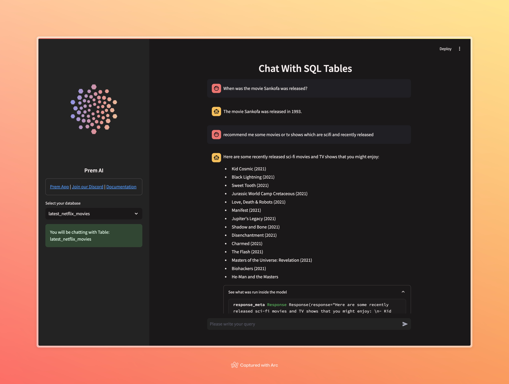

## Chat with SQL Tables using PremAI and LLamaIndex

In this recipe, we are going to make a simple chat application using [Prem AI llama-index](https://docs.llamaindex.ai/en/stable/examples/llm/premai/) to ask questions in natural language to a table from a database. We also create a simple webapp using streamlit which looks like this:



### Setting up the project 

It's quite simple. First clone the repository:

```bash
git clone https://github.com/premAI-io/cookbook.git
cd cookbook/chat-with-sql
```

After that, create a virtual environment and install the requirements.

```bash
python -m venv venv
source venv/bin/activate
pip install -r requirements.txt
```

### Running the app

Before running the app, please do not forget to add the secrets `premai_api_key ` to secrets.toml.template and remove `.template` from it. Please add the valid `PROJECT_ID` from the Prem App before running the app. To run the app, type the following command:

```bash
streamlit run main.py
```